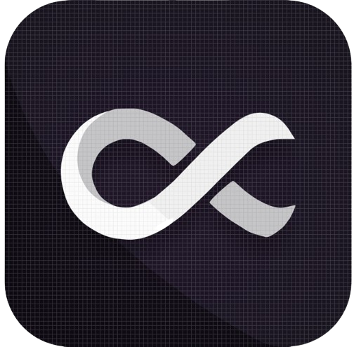

#  Ultima
[ultima.jrsmth.io](https://www.ultima.jrsmth.io)

## Explanation
- ⭕ Each square contains a smaller game of Tic-Tac-Toe
- ℹ️ [More info](https://www.thegamegal.com/2018/09/01/ultimate-tic-tac-toe/)

## Run Locally
- 🔧 `pip install -r src/app/requirements.txt`
- 🚀 `make start`